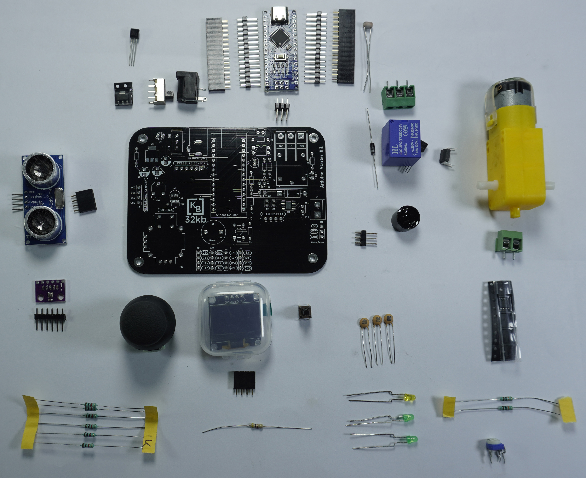
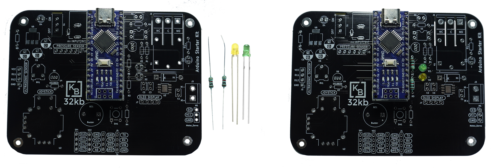
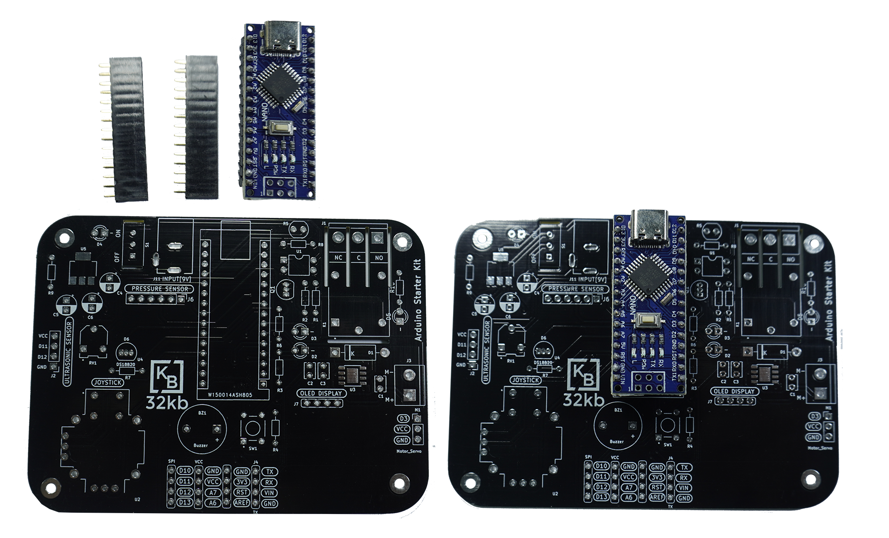

# 32KB Arduino Trainer Kit

Arduino trainer kit is self-sustained training solution that allows the user to learn, understand and teaches wide range of hobbyist as well as an academician. This is one stop solution to have an opportunity to learn wide range of sensors, actuators with allowing individual to add on the sensors they desire with an interfaces that we provide in the kit. The kit can be powered via an adaptor with 5v inputs externally or with the USB cables during programming.

## What is included in the package?

The package consists of the following components.

- PCB Board
- DC motor 
- Arduino Nano
- Motor Driver 
- Ultrasonic Sensor 	
- Servo Motor 
- Push button 	
- Buzzer 
- LDR 	
- LEDs 
- Pressure sensor 	
- Potentiometer 
- Temperature sensor 	
- Barrel jack Connector 
- Joystick 	
- Capacitors (Electrolytic and Ceramic) 
- OLED display 	
- Opto-coupler 
- Relay 	
- Transistor 
- Voltage regulator

## Some Warnings
- Check the Polarity of LEDS, BUZZER, DIODE and Capacitors while Connecting. 
- Check switch to ON and you can use adapter with max of 9V in barrel jack connector. 
- For the Arduino IDE choose Board Arduino Nano and Bootloader to old bootloader.
- Don’t place the board over the metallic surface or above/in water.
- Don’t use AC power supply as connection to board except relay.   

# Assembly Process
1. Solder the male headers in the Arduino as shown in the diagram below. 

2. Solder female header in the PCB in designated footprint in board as shown below. 

3. Take two LEDs and Resistors(1k) and solder them in their respective footprints ((D2 & D3 and  R3 & R6) as shown in the figure below. 

4. Take a temperature sensor and resistor (preferabally 4.7K) and solder in the foorprint (DS18B20 and R7) as  shown in figure below. 

5. Now take a ultrasonic sensor and 4 female header. Also take a buzzer. 
 
6. Solder female header in its footprint(J2) as well as buzzer (BZ1). Ensure to check the polarity of buzzer before connection
